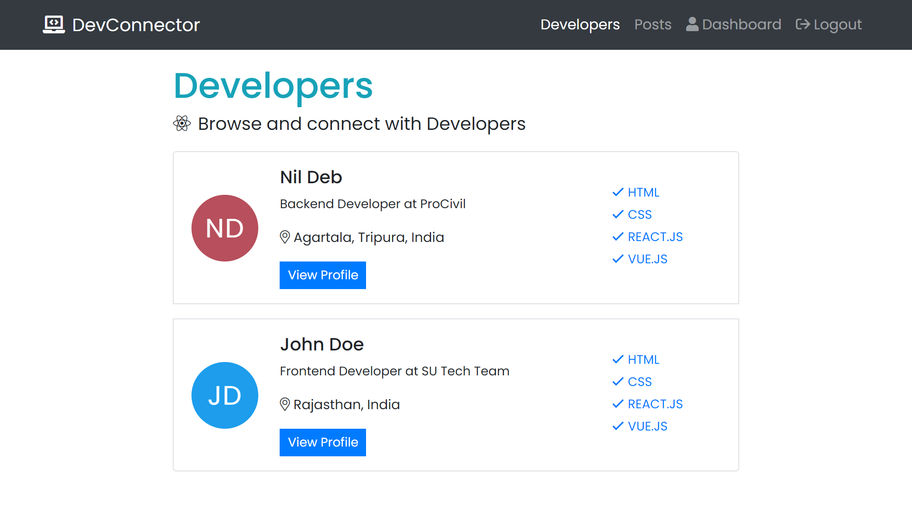

## DevConnector Web App using React JS

- #### Live Demo [here](https://devconnector.nildeb.xyz/)

  - Test User Credentials
    - Click on **`Demo Login`** for Testing

- #### Github Repository [link](https://github.com/nil1729/mern-stack-1.0)

---

### Technology and Modules used for this Project

1. `Node JS Express Framework` is used as a building Backend part of this Website.
2. `MySQL` is used to Store User Details, passwords and URL of Photos.
3. `JWT` is used for for Authenticate a User. User can only authenticate using **Custom Email Password** Method.
4. `React JS` is used as frontend Framework for building SPA.
5. `Redux` for State Management on React Application
6. `Bootstrap` is used for building UI and this website is Responsive for Desktop Devices and Tabs only (I am working on for responsiveness on small Devices)
7. `Heroku` is used for hosting the backend code and frontend as well.

---

## Run this Project on Local Environment

1. **Prerequisites**

- NodeJS installed on your Local machine
- MySQL (version 8.0) installed on your local machine or have any MySQL database hosted online
  - First I use [CloudClusters](https://www.cloudclusters.io/) for my project.
  - Now, I am using [Digital Ocean](https://m.do.co/c/bf7c82c22af1) Droplet to install mysql and use it remotely to my app.

2. **Project Setup**

   - Clone this Repository or Download the zip File.
     ```
     $ git clone https://github.com/nil1729/mern-stack-1.0
     ```
   - Create a new file named `.env` on `root` directory which contains all of our secret credentials for this project.

     ```
     DB_HOST = <Database Hostname>
     DB_PORT = <Database Port>
     DB_USER = <Database User>
     DB_USER_PASSWORD = <Database User Password>
     DB_DATABASE = <Database Name>
     BCRYPT_SALT_LENGTH = 10
     JWT_SECRET = <Your JWT Secret>
     JWT_RANDOM_STRING = <Any Random String>
     JWT_COOKIE_MAX_AGE = 86400
     GITHUB_TOKEN = <Personal Access Token for Github API>
     PORT = <Which port NodeJS server should listen on your local machine>
     ```

   - Run this command

     ```
     $ npm run dev  // to start React Development server and Backend server together.

     $ npm run server // to start only Backend server

     $ npm run Client // to start React Development server only (But it will not working alone as api depends on Backend also)
     ```

---

### Website Preview

## 

---

### TODO:

- Email Verification by Send Grid API
- User Profile Image upload feature (Cloudinary API)
- Forgot Password Feature
- Pagination feature on Posts and Developers page

---

**Acknowledgements**

_Project Idea based on a MERN Stack course instructed by [Traversy Media](https://www.udemy.com/course/mern-stack-front-to-back/)_
